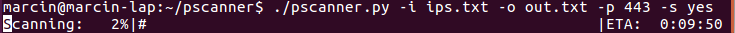

# Parallel IP Scanner

Parallel IP port scanner with progressbar and SSL support

## Description

Parallel IP port scanner with progressbar and SSL support. Cut the scan time based on the amount of the cores installed on your computer.



## Dependencies


1) * [python-progressbar](http://code.google.com/p/python-progressbar/)

or

pip install progressbar

2) * [embparpbar.py](https://github.com/esc/embparpbar/)

Available in the package

3) pip install requests (for the Certificate bundle)


## Installation

Everything is in the repo , so just drop the files to where you want to use it.

## Usage

```
usage: pscanner.py [-h] -i INPUT -o OUTPUT -p PORT -s SSL

Port Scanner v0.99

optional arguments:
  -h, --help            show this help message and exit
  -i INPUT, --input INPUT
                        Input list of IPs or domains
  -o OUTPUT, --output OUTPUT
                        Output
  -p PORT, --port PORT  Port number(s). Range, i.e 20-1000 or comma seperated
  -s SSL, --ssl SSL     SSL yes|no

```

## Sample run:

```

marcin@marcin-lap:~/pscanner$ more ips.txt 
127.0.0.1
www.gmail.com
www.google.com
marcin@marcin-lap:~/pscanner$ ./pscanner.py -i ips.txt -o out.txt -p 442-445 -s yes
Scanning: 100%|###################################################|Time: 0:00:00
marcin@marcin-lap:~/pscanner$ more out.txt 
127.0.0.1,442,closed
127.0.0.1,443,closed
127.0.0.1,444,closed
127.0.0.1,445,closed
www.gmail.com,442,closed
www.gmail.com,443,open,CN:mail.google.com,CERT OK
www.gmail.com,444,closed
www.gmail.com,445,closed
www.google.com,442,closed
www.google.com,443,open,CN:www.google.com,CERT OK
www.google.com,444,closed
www.google.com,445,closed

```


## Website

Repository is at: https://gitlab.com/marcinguy/pscanner

## Author, Copyright and License

(C) 2016 Marcin Kozlowski <marcinguy@gmail.com>

pscanner is licensed under the terms of the MIT License.

Permission is hereby granted, free of charge, to any person obtaining a copy of
this software and associated documentation files (the "Software"), to deal in
the Software without restriction, including without limitation the rights to
use, copy, modify, merge, publish, distribute, sublicense, and/or sell copies
of the Software, and to permit persons to whom the Software is furnished to do
so, subject to the following conditions:

The above copyright notice and this permission notice shall be included in all
copies or substantial portions of the Software.

THE SOFTWARE IS PROVIDED "AS IS", WITHOUT WARRANTY OF ANY KIND, EXPRESS OR
IMPLIED, INCLUDING BUT NOT LIMITED TO THE WARRANTIES OF MERCHANTABILITY,
FITNESS FOR A PARTICULAR PURPOSE AND NONINFRINGEMENT. IN NO EVENT SHALL THE
AUTHORS OR COPYRIGHT HOLDERS BE LIABLE FOR ANY CLAIM, DAMAGES OR OTHER
LIABILITY, WHETHER IN AN ACTION OF CONTRACT, TORT OR OTHERWISE, ARISING FROM,
OUT OF OR IN CONNECTION WITH THE SOFTWARE OR THE USE OR OTHER DEALINGS IN THE
SOFTWARE.

